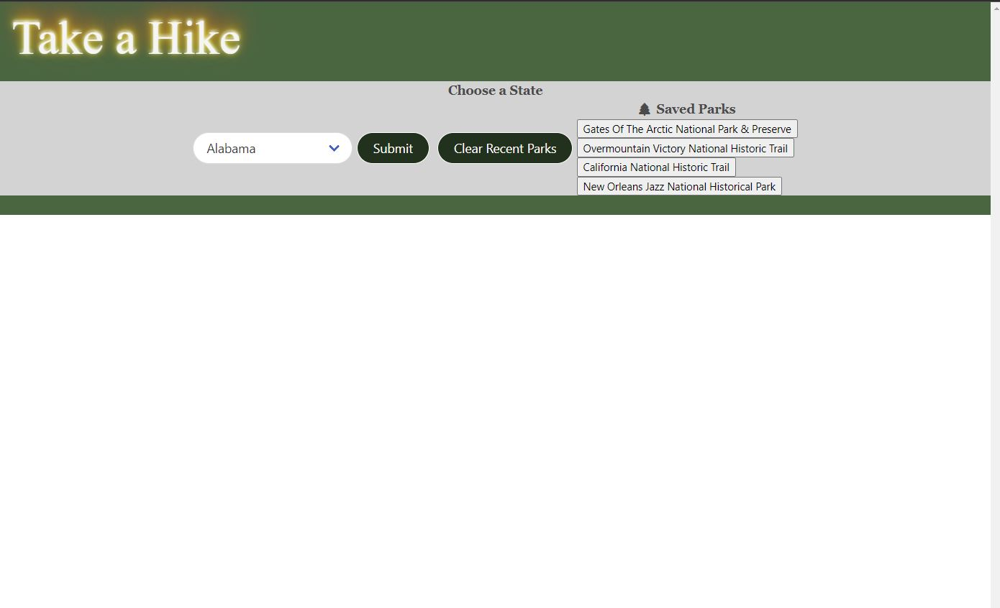
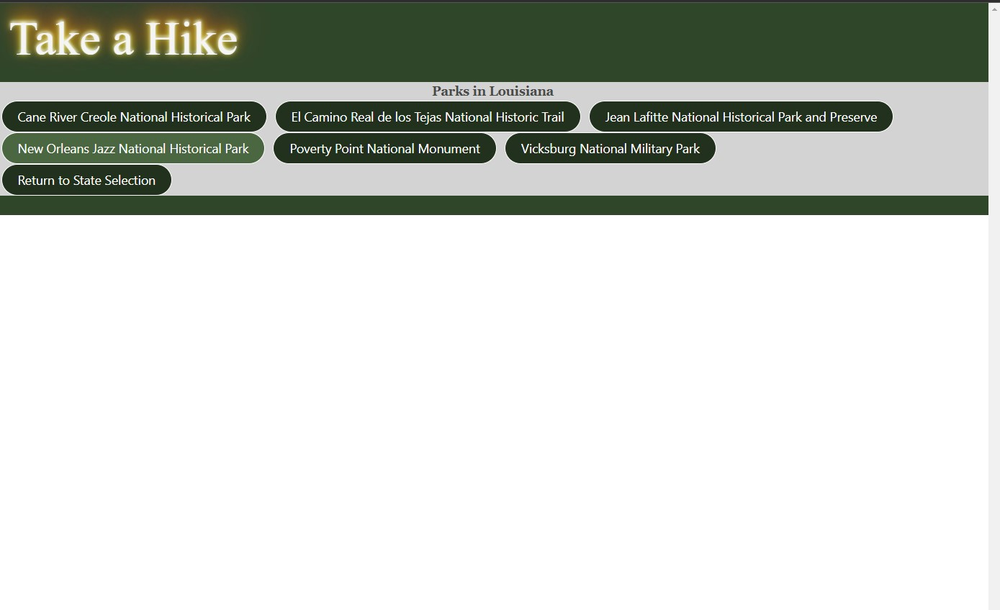
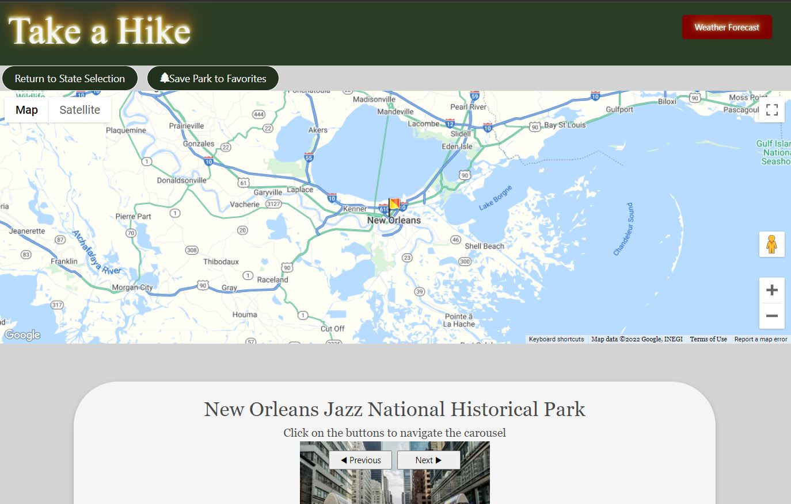
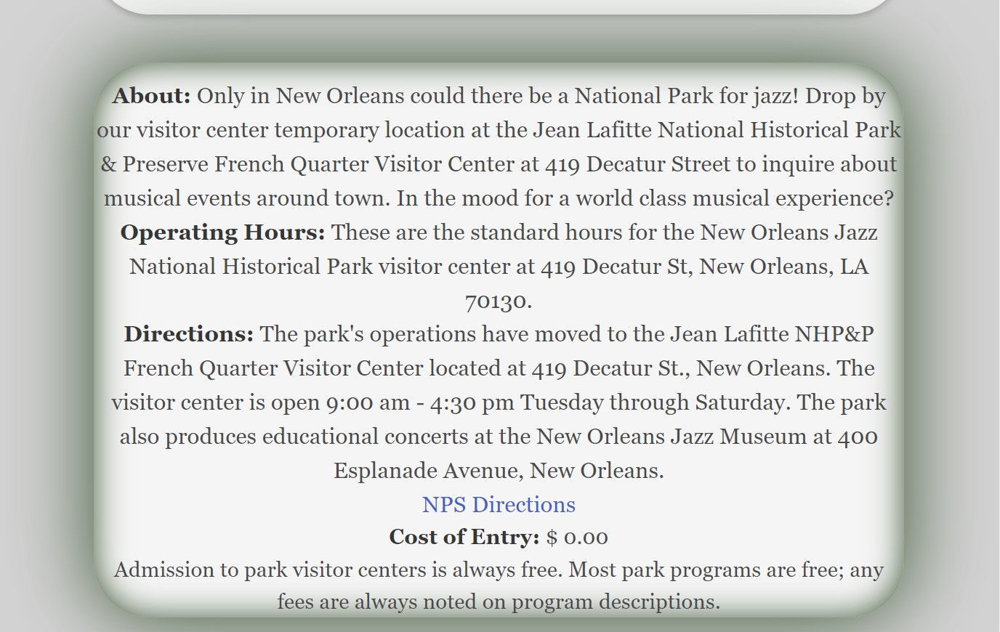
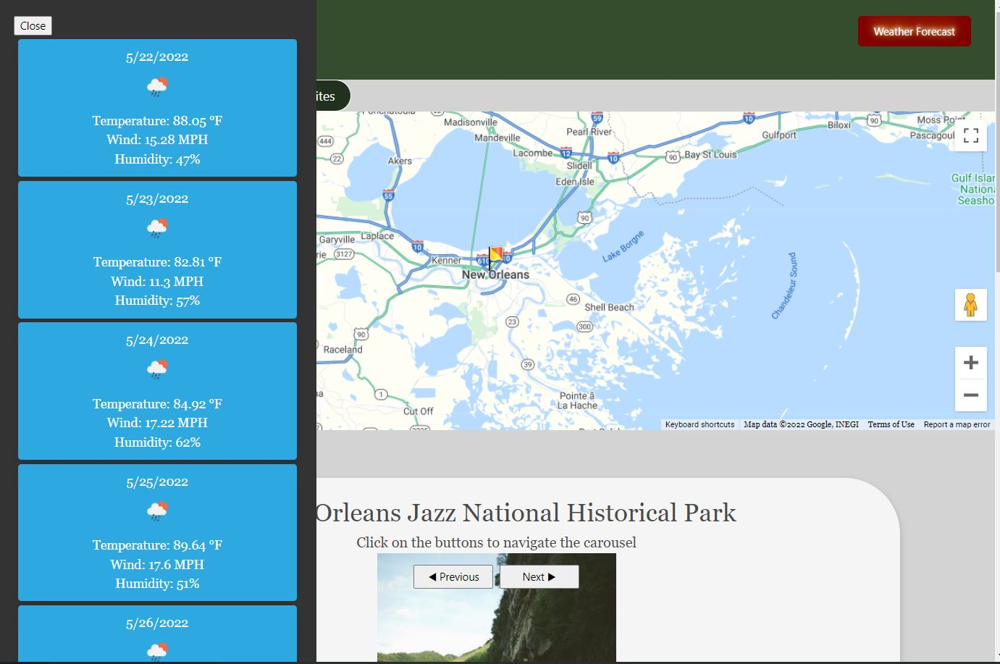
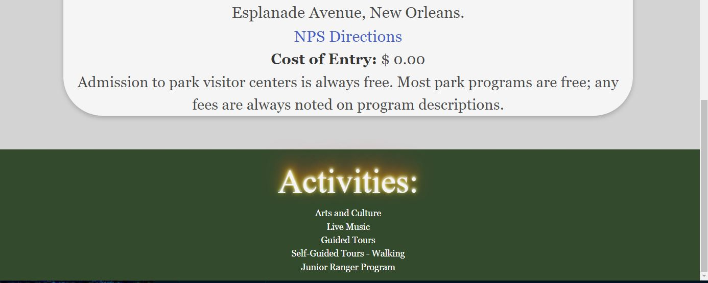

# Take a Hike

 

# Github Repository and Deployed Application:

 
 
Deployed Page Link: https://guapguap.github.io/travel-project/
 
Github Repo: https://github.com/Guapguap/travel-project
 
 
Group Members: Alberto, Arthur, Mason, Timothy
 
 
Concept:
As an avid outdoor person, I wanted to go to a website that gives me high level park information when I select a park that I wanted to checkout.
 
 
Roles:
 
 
Alberto: Worked on the JavaScript. Focused on the functionality of the Park selection, park display of information (park buttons, carousel, activites), local storage
 
Mason: Worked on the JavaScript. Focused on the functionality of the maps, weather, park display of information (about and description), local storage.
 
Timothy: Worked on the CSS and HTML. Focused on the styling and layout of the website to be engaging and user intuitive.
 
Arthur: Worked on the ReadMe, PowerPoint, and Software Testing. Focused on fleshing out the bugs and errors of the current main branch.
 
 
#Version 2.0 Might Include:
 
 
The addition of photos to the corresponding parks in the park list would be an enhancement. Style updates might be to add a background image and animation to the State drop down list. Google Maps could be expanded to include additional pins.
 
 
#General Functionality:
 
 
The user is initially presented with a drop down to select a US State. Upon selecting "Submit" the transition presents a list of State specific National Parks
from which the user would make a selection. The result would present the user with a Google Map, Park specific photo carousel, historical details about the
selected park and a list of interesting activities available at the park. There is also entry cost details and a National Park Directory link for travel help.
Additionally, the "Weather Forecast" button becomes available. When the "Weather Forecast" button is selected the user is presented with a 5 days forecast of
the specific park. The "Weather Forecast" button will close the 5 day forecast window. At the top of the screen there is a "Select State" button which will
bring the user back to a screen that allows the user to select a different state and collection of parks. To the right of the screen a list of each park
explored is saved for reference. The "Clear Recent Parks" button will clear this list from the screen.
 
 

# Challenges

 

- Connecting the NPS api to our google maps and openweather apis
- Time management- deciding which features/issues should be prioritized
- LocalStorage- using multiple values per object was a challenge
- Page display-Swapping between different pages meant having to show/hide different elements

   
   
   

# Demo:

 

 
 

# Screenshots:

 
Search Screen lets you select parks by state via dropdown selection

 
 
Park list added after state selection

 
 
Park Landing Page opens with location display via Google Maps

 
 
Park information from api to National Park Service website

 
 
Dynamic 5 day weather forecast for chosen park using an openweathermap.org api

 
 
List of park activities

 
 
# License & Copyright:
 
 
Licensed under the [MIT](LICENSE) license.
